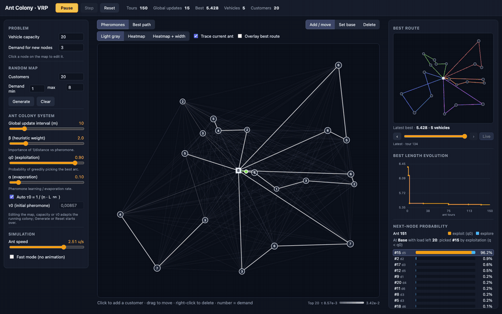
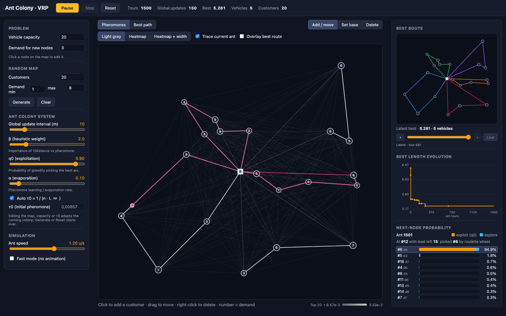
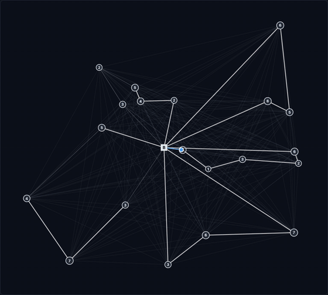
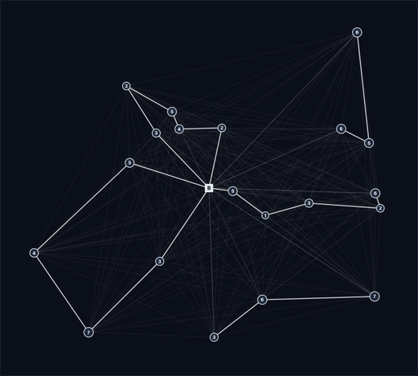
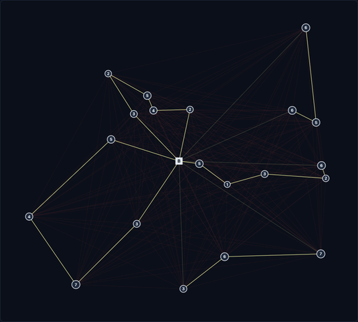
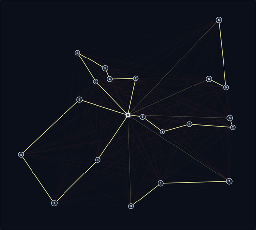
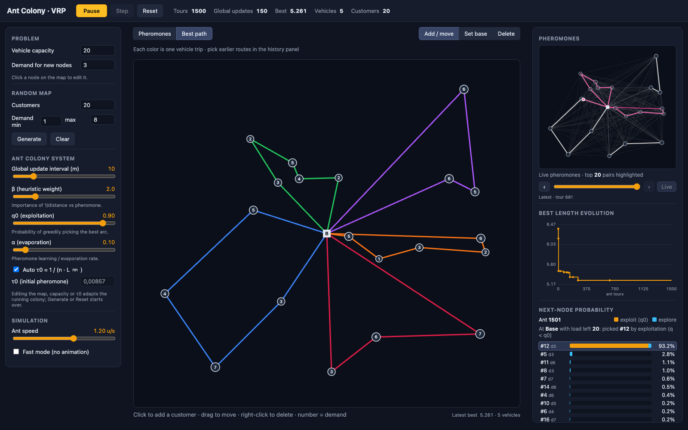
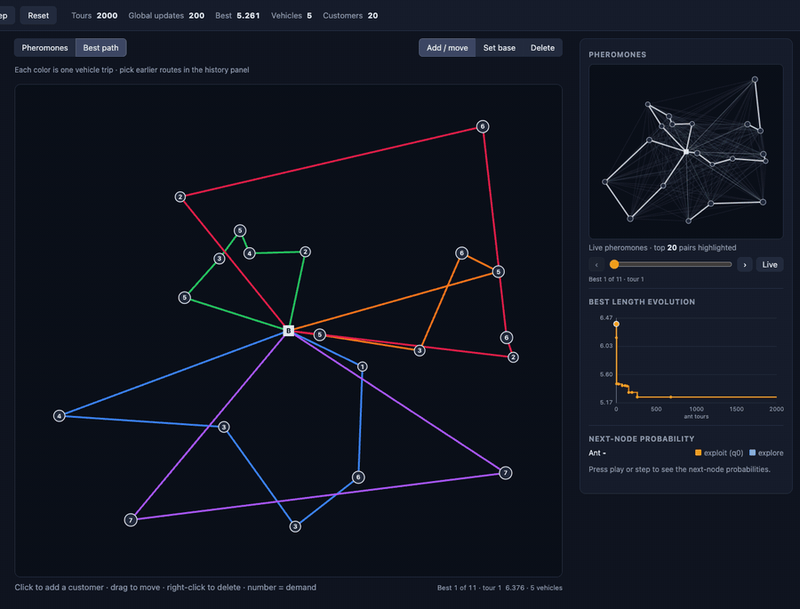
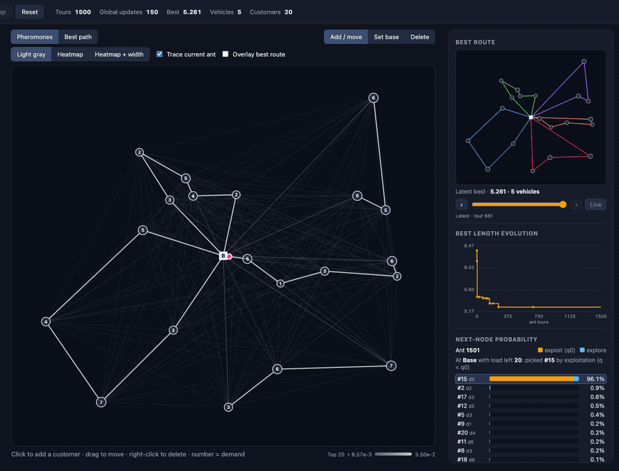
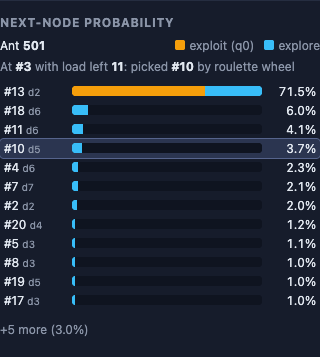

# Ant Colony · VRP

An interactive, in-browser visualization of **Ant Colony Optimization (ACO)** solving the **Capacitated Vehicle Routing Problem (CVRP)**. Place a base and customers on a map, tune the algorithm, press play and watch each ant build its tour, the pheromone trails emerge and the best route improve.

**Live demo:** <https://pablof27.github.io/vrp-app/>

> **Academic context** — This project is based on **"ACO for VRP"**, a project for the **Multi-Agent Systems** course of the **Master's in Artificial Intelligence**. The original ant colony model has been extended into a step-by-step simulation with an interactive visual interface.



## Table of contents

- [Features](#features)
- [Visual tour](#visual-tour)
- [The problem](#the-problem)
- [The algorithm](#the-algorithm)
- [Parameters](#parameters)
- [Getting started](#getting-started)
- [Using the app](#using-the-app)
- [Project structure](#project-structure)
- [Using the model on its own](#using-the-model-on-its-own)
- [Testing](#testing)
- [Known issues](#known-issues)
- [Credits](#credits)

## Features

- **Interactive map editor** — add, drag and delete customers, move the base and edit each customer's demand.
- **Step-by-step animation** — one ant at a time walks its tour. Pheromones evaporate after every ant and the best route is reinforced every `m` ants.
- **Pheromone visualization** — the 20 strongest edges are always highlighted and weaker edges fade into the background, in three styles (light gray, heatmap, heatmap + width).
- **Multiple colonies** — each vehicle trip is learned by its own colony. The ant, its trace and the best route's trips take the colour of their colony, and a dashed ring at the base shows which colony takes over at each reload. You can show the pheromones of the walking colony, of one chosen colony, or of all colonies at once.
- **Two views** — switch the main map between the pheromone view and the best route (one color per vehicle trip). The minimap always shows the other view.
- **Best route history** — browse every improvement found so far, each drawn on the map as it was when it was found.
- **Live adaptation to map edits** — moving customers, changing demands or capacity does not restart the colony. Pheromones and the current ant are kept and the best route is repaired and re-measured, so its length can go up.
- **Explainable decisions** — a bar chart shows, for the current ant, the probability of each customer being chosen next, split into exploitation and exploration.
- **Convergence chart** — best route length over completed ant tours, with markers where the map was edited. Click any point to view that route.
- **Fast mode** — run hundreds of tours per frame without animation to converge quickly.

## Visual tour

### Overview



The interface has three columns:

- **Left:** problem and algorithm parameters.
- **Center:** the main map.
- **Right:** the minimap with the best route history, the best-length chart and the next-node probabilities of the current ant.

### Ants building tours



Each ant starts at the base (**B**), visits customers until its load runs out, returns to the base to reload and continues until every customer has been served. The colored line is the tour of the current ant, and the customers it has already visited are dimmed. The number inside each customer is its demand.

### Pheromone styles

| Light gray | Heatmap | Heatmap + width |
| :---: | :---: | :---: |
|  |  |  |

All styles use transparency and keep stroke widths under 2.2 px. The 20 pairs of nodes with the most pheromone are always clearly visible; the remaining edges stay as faint context.

### Best path view and history



The **Best path** view draws the best route found so far, with one color per vehicle trip, while the minimap switches to the live pheromones.



Use the history navigator (‹ ›, the slider or **Live**) or click any point in the best-length chart to go back to an earlier best route.

### Editing the map while it runs



Editing the map does not restart the algorithm. Here a customer is added and dragged to a far corner:

- The colony carries on from where it was.
- The best route is repaired to include the new customer and re-measured, so its length jumps up.
- The chart marks the edit with a dashed line.

### Next-node probabilities



For the current ant's last decision, each bar is the probability of choosing that customer next:

- **Orange** is the exploitation share (`q0` on the best candidate).
- **Blue** is the exploration share (the roulette wheel).
- The chosen customer is highlighted.
- Customers whose demand exceeds the remaining load are shown in red, because choosing them sends the ant back to the base.

This example uses `q0 = 0.5` to make the exploration share easier to see.

## The problem

In the **Capacitated Vehicle Routing Problem** a fleet of identical vehicles with capacity $Q$ must serve a set of customers, each with a demand $d_i$, starting and ending at a common base. Every customer is visited exactly once and the load of a vehicle on each trip cannot exceed $Q$. The goal is to minimize the total distance travelled.

In this app a solution is a single path that starts at the base, visits every customer and returns to the base whenever the vehicle needs to reload; each segment between two visits to the base is one vehicle trip. Distances are Euclidean on a 1 × 0.9 world.

## The algorithm

The model is an **Ant Colony System (ACS)** variant, implemented in [Model/AntColony.js](Model/AntColony.js).

**Tour construction.** An ant at node $i$ scores every unvisited customer $j$ with

$$
s_{ij} = \tau_{ij} \cdot \left(\frac{1}{d_{ij}}\right)^{\beta}
$$

where $\tau_{ij}$ is the pheromone on edge $(i, j)$ and $d_{ij}$ the distance. It then applies the **pseudo-random proportional rule**:

- with probability $q_0$ it **exploits**, picking the customer with the highest score;
- otherwise it **explores**, picking a customer with probability $s_{ij} / \sum_k s_{ik}$ (roulette wheel).

If the chosen customer's demand does not fit in the remaining load, the ant returns to the base to reload and the customer stays pending. An ant whose partial tour is already longer than the best one found so far gives up and returns to the base.

**Pheromone evaporation.** After every ant completes its tour, all edges evaporate towards $\tau_0$:

$$
\tau_{ij} \leftarrow (1 - \alpha)\,\tau_{ij} + \alpha\,\tau_0
$$

**Global update.** After every $m$ completed ants, the edges of the best route found so far, of length $L_{best}$, are reinforced:

$$
\tau_{ij} \leftarrow (1 - \alpha)\,\tau_{ij} + \frac{\alpha}{L_{best}}
$$

Ants run **sequentially**: each ant sees the pheromones left after the previous ant's evaporation, and `m` is the interval between global updates, not a number of parallel ants.

**Initial pheromone.** By default $\tau_0 = 1 / (n \cdot L_{nn})$, where $n$ is the number of nodes and $L_{nn}$ the length of a capacity-aware nearest-neighbour tour.

**Dynamic problems.** When the map changes, the colony adapts instead of restarting:

- **Nodes:** each node has a stable id.
- **Pheromones:** the matrix is remapped, and new nodes start at $\tau_0$.
- **Current ant:** it keeps walking with its route length and remaining load recalculated. It starts over only if its partial tour is no longer valid.
- **Best route:** it is repaired and re-measured:
  - deleted customers are removed;
  - new customers are inserted where they add the least distance;
  - returns to the base are added wherever capacity would be exceeded.

## Parameters

| Parameter | Where | Default | Meaning |
| --- | --- | --- | --- |
| Vehicle capacity $Q$ | Problem | 20 | Maximum load per vehicle trip. |
| Demand for new nodes | Problem | 3 | Demand given to customers added by clicking the map. |
| Customers / demand range | Random map | 20 / 1–8 | Size and demands used by **Generate**. |
| Colonies | Ant Colony System | 1 | Number of colonies, each with its own pheromones. Trip $k$ of a tour is walked by colony $k \bmod$ colonies. |
| Global update interval $m$ | Ant Colony System | 10 | Number of completed ants between global updates of the best route. |
| $\beta$ | Ant Colony System | 2 | Weight of the distance heuristic relative to the pheromone. |
| $q_0$ | Ant Colony System | 0.9 | Probability of exploiting (greedy choice) instead of exploring. |
| $\alpha$ | Ant Colony System | 0.1 | Evaporation and learning rate. |
| $\tau_0$ | Ant Colony System | auto | Initial pheromone; automatic $1/(n \cdot L_{nn})$ or a fixed value. |
| Ant speed | Simulation | 0.6 u/s | Animation speed of the current ant, in map units per second. |
| Fast mode / tours per frame | Simulation | off / 20 | Run tours without animation, this many per frame. |

$\beta$, $q_0$, $\alpha$ and $m$ can be changed while the colony is running. Capacity, $\tau_0$, the number of colonies and map edits also apply live (existing colonies keep what they learned; new ones start at $\tau_0$); **Generate** and **Reset** start from scratch.

## Getting started

**Requirements:** [Node.js](https://nodejs.org/) `^20.19.0` or `>=22.12.0` (required by Vite 8) and npm.

```bash
git clone https://github.com/Pablof27/vrp-app.git
cd vrp-app
npm install
npm run dev
```

Then open the URL printed by Vite (by default <http://localhost:5173>).

| Command | Description |
| --- | --- |
| `npm run dev` | Start the development server with hot reload. |
| `npm run build` | Build the production bundle into `dist/`. |
| `npm run preview` | Serve the production build locally. |
| `npm test` | Run the unit tests with the Node.js test runner. |

### Deployment

The app is deployed to GitHub Pages by the workflow in [.github/workflows/deploy.yml](.github/workflows/deploy.yml). Every push to `main` runs the tests, builds the app and publishes `dist/`. The build uses the `/vrp-app/` base path configured in [vite.config.js](vite.config.js); change it if the repository is renamed.

## Using the app

**Top bar**

- **Play / Pause** runs the simulation.
- **Step** moves the current ant one arc (in fast mode, it runs a batch of tours).
- **Reset** clears pheromones and history and starts over.
- The counters show completed tours, global updates, best route length, number of vehicles and customers.

**Map**

| Action | Result |
| --- | --- |
| Click on an empty spot (**Add / move** tool) | Add a customer with the default demand. |
| Drag a node | Move it; the colony adapts while you drag. |
| Right-click a customer, or use the **Delete** tool | Delete it. |
| **Set base** tool, then click | Move the base. |
| Click a node | Select it and edit its demand in the left panel. |

**Views**

- **Pheromones / Best path** switches the main map. The read-only minimap on the right always shows the other view.
- In the pheromone view you can choose the drawing style, hide the current ant's trace and overlay the best route as a dashed line.
- With more than one colony, **Walking / All / 1…n** chooses whose pheromones are drawn. **All** overlays each colony's top pairs in its colour.

**Best route history**

- Step through previous best routes with ‹ ›, drag the slider, or click a point in the **Best length evolution** chart.
- **Live** returns to the latest route.
- Editing the map also returns to the live route.

## Project structure

```text
vrp-app/
├── Model/
│   ├── AntColony.js                  # ACO model: tour construction, pheromone updates, dynamic repair
│   └── AntColony.test.js
├── src/
│   ├── App.jsx                       # Layout, state and wiring of all panels
│   ├── App.css                       # Styles
│   ├── main.jsx                      # React entry point
│   ├── hooks/
│   │   ├── useColonySimulation.js    # Simulation loop: sequential ants, fast mode, map adaptation, history
│   │   └── useColonySimulation.test.js
│   ├── components/
│   │   ├── MapCanvas.jsx             # Main map and read-only minimap (canvas)
│   │   ├── ParametersPanel.jsx       # Problem, algorithm and simulation controls
│   │   ├── ConvergenceChart.jsx      # Best length chart (SVG)
│   │   ├── ProbabilityBars.jsx       # Next-node probability bars
│   │   └── BestHistoryNavigator.jsx  # Previous best route browser
│   └── lib/
│       ├── draw.js                   # Canvas drawing helpers and pheromone ranking
│       ├── draw.test.js
│       └── nodes.js                  # Stable node ids
├── docs/images/                      # Screenshots and GIFs used in this README
├── index.html
├── vite.config.js
└── package.json
```

## Using the model on its own

`AntColony` has no UI dependencies and can be used from Node.js or the browser:

```js
import { AntColony } from './Model/AntColony.js';

const colony = new AntColony();
const vrp = colony.newMap(21, 20, { min: 1, max: 8 }); // base + 20 customers, capacity 20
const params = { n: vrp.nodes.length, m: 10, beta: 2, q0: 0.9, alpha: 0.1, tau0: 0.01, colonies: 3 };

let pheromones = colony.resetPheromones(params); // one n×n matrix per colony
const bestPath = { path: [], length: Infinity };

for (let iter = 0; iter < 2000; iter++) {
  ({ pheromones } = colony.advance(vrp, params, pheromones, bestPath, iter));
}

console.log(bestPath.length, bestPath.path); // e.g. [0, 17, 15, 2, 0, 9, 6, 0, ...]
```

**Multiple colonies.** With `colonies > 1`, each vehicle trip is walked by an ant from a different colony, and each colony has its own pheromone matrix. Trip $k$ of a tour belongs to colony $k \bmod$ `colonies`, so every tour starts with the first colony and the next colony takes over each time an ant returns to the base. Customers served by earlier trips are skipped. All matrices evaporate after every tour. Every $m$ tours, each colony reinforces only the trips it walked in the best tour. `colonies: 1` gives the single-colony behavior.

| Method | Purpose |
| --- | --- |
| `advance(vrp, params, pheromones, bestPath, iter)` | Run one complete ant tour and apply the pheromone updates. |
| `createAnt(vrp)` / `step(...)` / `finishAnt(...)` | Build a tour one arc at a time (used by the animation). `ant.colony` and the step's `colony` show which colony is moving. |
| `arcColonies(path, colonies)` | Colony that walked each arc of a tour. |
| `candidateScores(...)` / `selectionProbabilities(scores, q0)` | Scores and selection probabilities of the next customer. |
| `newMap(n, capacity, demand)` / `buildVrp(nodes, capacity)` | Create a random instance or build one from nodes. |
| `resetPheromones(params)` / `evaporatePheromones(...)` / `globalUpdate(...)` | Pheromone initialization and updates. |
| `remapPheromones(...)` / `repairPath(vrp, path)` / `adaptAnt(...)` | Adapt the colony to a changed map. |

## Testing

```bash
npm test
```

The tests use the built-in Node.js test runner (`node --test`) and cover:

- **Model:** evaporation after every ant, a global update after exactly every `m` ants, and each ant seeing the pheromones left by the previous one.
- **Simulation:**
  - there is only one active ant;
  - animated and fast mode produce the same results;
  - map edits keep the colony's progress;
  - the history keeps each best route together with its map.
- **Rendering:** top-20 pheromone selection, transparency, stroke width limits and the gray style.

## Known issues

- The browser console can repeatedly report `ResizeObserver loop completed with undelivered notifications` during development. It appears to come from the canvas sizing code and has not been fixed yet.

## Credits

- Based on **"ACO for VRP"**, a project for the **Multi-Agent Systems** course of the **Master's in Artificial Intelligence**.
- Author: **Pablo Fornet Martín** ([@Pablof27](https://github.com/Pablof27)).
- The algorithm follows the Ant Colony System of M. Dorigo and L. M. Gambardella, *"Ant Colony System: A Cooperative Learning Approach to the Traveling Salesman Problem"*, IEEE Transactions on Evolutionary Computation, 1997, adapted to vehicle routing with capacity constraints.
- Built with [React](https://react.dev/) and [Vite](https://vite.dev/).
